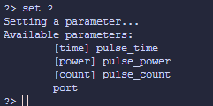
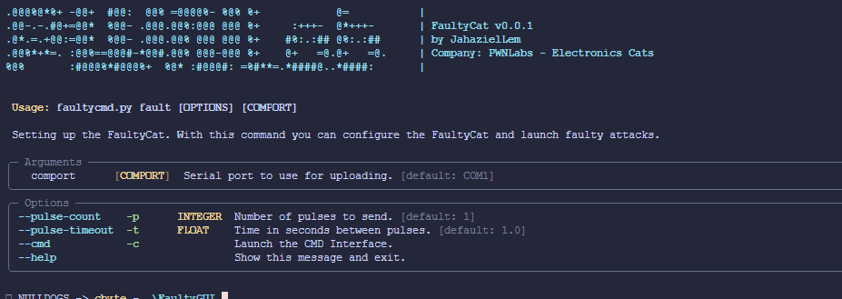

# FaultyCMD

This tools is created to handle the FaultyCat board serial interface to create automated pulse.

## Functionality
The Faulty firmware has a serial interface that works with a commands:
```
FaultyCat Commands:
- <empty to repeat last command>
- [h]elp
- [a]rm
- [d]isarm
- [p]ulse
- [en]able_timeout
- [di]sable_timeout
- [f]ast_trigger
- [in]ternal_hvp
- [ex]ternal_hvp
- [conf]ig: pulse_time=5, pulse_power=0.012200
- [t]oggle_gp1
- [s]tatus
- [r]eset
```

This scripts uses the original commands to send in a sequence to:
- Arm the device
- Send the pulse
- Disarm the device

When a time and pulse count are set, the script run a sequence to sent the `n` pulses with a `x` time between next pulse.

## Requirements
This script use the next librarys if you want to install manually or you can run the `pip install -r requirements.txt`

## CMD Interface
The script implement a command and control interface to set the settings directly like a `metasploit` console or the capacity to run it with only the arguments.

### Run in CMD mode
To run the cmd mode yyo can use the next command: `python faultycmd.py fault -c `.


With this we have a minimal commands to configure and start the faulty attack, the available commands are:
- config
- exit
- help
- set
- start

#### Command config
This command show the config of the board.


#### Command exit
This command close the interface and exit the script.

#### Command help
Show the availables commands

#### Command set
This commands is used to configure the board, to know what options we can change and the command we use `set ?`.

The command is formed like:
- **set**: The main command
- **option**: The config option you want change
- **valuie**: The config value that you wanna change
We can use the short form `set time 2` or the largest form: `set pulse_time 2`.


#### Commmand start
When we have all configured we can use the **start** command to launch the fault injection, when finished we can reconfigure o start again the attack.


## Argument format

We can launch the script without the Cmd interface, only set the parameters in the execution of the script.
`python faultycmd fault <PUERTO_COM>`

To set the options to perform a better attack we can use:
- **-p**: Set the number of pulses to send
- **-t**: Set the time in seconds to send the next pulse
- **-c**: Launche the Cmd Interface

## Other Commands

### Config
Show the current config of the board

## devices
List the availables serial devices in the system